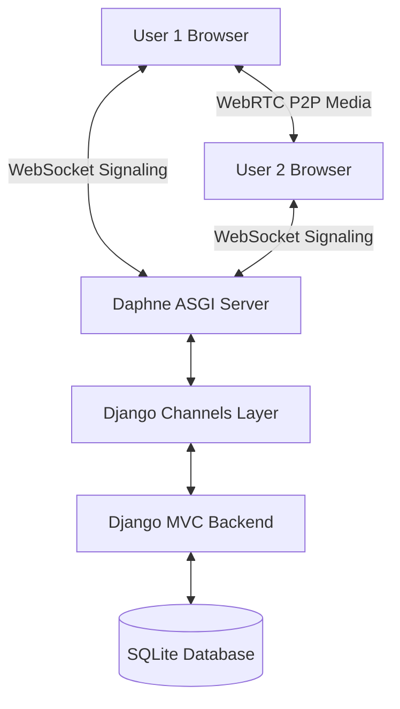

# vZoom Meeting Platform - Project Report

This report provides a detailed technical overview of the **vZoom Meeting Platform**, a real-time video conferencing web application built with **Django, Django Channels (WebSockets), WebRTC, and SQLite**.

---

## 1. System Architecture

The project is structured as a single-page collaborative room application supported by a Django backend:
* **Backend Framework:** Django 5.0 (Python)
* **Real-time Signaling Server:** Django Channels & Daphne (ASGI server) for WebSockets.
* **Peer-to-Peer Media Transport:** WebRTC Mesh network for video, audio, and screen sharing directly between participants.
* **Database:** SQLite 3 (`db.sqlite3`) for persistent storage of users, profiles, meetings, participants, and chat histories.

---

## 2. Database Models (`meetings/models.py`)

The application defines four core models to manage platform states and persistence:

1. **`UserProfile`:** Extends the built-in Django `User` model with custom avatar colors and bios.
2. **`Meeting`:** Stores meeting configuration metadata:
   * Unique `meeting_id` (generated as a `xxx-xxxx-xxx` string).
   * Host reference (`ForeignKey` to `User`).
   * Access flags (`is_waiting_room`, `is_locked`, `is_active`).
   * Optional password protection.
3. **`MeetingParticipant`:** Tracks users entering and exiting meetings:
   * Tracks join time (`joined_at`) and exit time (`left_at`).
   * Host approval state (`is_approved`) for waiting rooms.
4. **`ChatMessage`:** Stores meeting chat logs (both public group chats and private peer-to-peer chats).

---

## 3. Key WebRTC & WebSocket Flows

### 3.1 WebRTC Mesh Connection
The platform operates a full-mesh network where every peer establishes a direct `RTCPeerConnection` with every other peer. WebSockets are used purely for signaling:
1. When a new peer enters the room, they register with the WebSocket group.
2. The WebSocket broadcasts `peer_joined` containing their channel name.
3. Existing peers receive this and generate a local `sdp-offer` which is relayed back to the newcomer.
4. The newcomer responds with an `sdp-answer` and ICE candidates are exchanged to establish P2P streaming.

### 3.2 Waiting Room Admission Flow
1. When `is_waiting_room` is enabled, non-host participants are initialized with `approved = False`.
2. The participant sees a loading waiting screen and sends a `waiting_room_request` event.
3. The Host receives a notification toast containing action buttons: **Admit** and **Deny**.
4. Accepting triggers a socket notification changing the peer's state to approved, removing the waiting screen, and establishing media streams.

---

## 4. Key Custom Features Developed

During recent iterations, we have implemented several robust features and resolved key usability issues:

* **Direct Floating Admission Controls:** Designed a floating notification toast for host screens. When a guest requests entry, the host can click **Admit** or **Deny** directly from the popup without needing to open the sidebar.
* **Direct Admin Dashboard Approval:** Added inline approval controls on the **Admin Dashboard** active meetings list. Administrators can view waiting guest names and approve them instantly.
* **Unified Control Bar & Participants Toggle:** Integrated a new **Participants** button in the footer control bar. It matches standard Zoom layouts, allowing instant toggles of the participants panel.
* **Adaptive Media Permission Handling:** Upgraded the media device capturing logic (`initLocalMedia`) with defensive fallbacks. If a device has a missing camera or mic, the application falls back to whichever is active (video-only or audio-only) rather than crashing. Added secure context HTTPS checking to warn users of modern browser policy constraints.
* **Overlay Panel layout:** Repositioned the sidebar layout to absolutely overlay the screen, preventing page layout shifts or video size reduction when opening the chat or participant drawers.
* **In-Meeting Screen & Audio Recording:** Added local browser-based recording. Users can record the screen capture and tab audio, generating a `.webm` file and downloading it automatically upon completion.

---

## 5. File & View Map

| Filename | Directory | Purpose |
| :--- | :--- | :--- |
| [views.py](file:///c:/Users/Vijay/Documents/zoom/meetings/views.py) | `meetings/` | Contains views for Auth, Dashboard, Meeting Rooms, and Admin Portal. |
| [consumers.py](file:///c:/Users/Vijay/Documents/zoom/meetings/consumers.py) | `meetings/` | Handles real-time WebSockets and signaling states. |
| [room.js](file:///c:/Users/Vijay/Documents/zoom/static/js/room.js) | `static/js/` | Contains frontend WebRTC, recording, and UI drawer logic. |
| [room.html](file:///c:/Users/Vijay/Documents/zoom/templates/room.html) | `templates/` | Template layout for the video room. |
| [admin_dashboard.html](file:///c:/Users/Vijay/Documents/zoom/templates/admin_dashboard.html) | `templates/` | Template for platform administration. |
| [style.css](file:///c:/Users/Vijay/Documents/zoom/static/css/style.css) | `static/css/` | CSS Styling for the modern glassmorphism design. |
